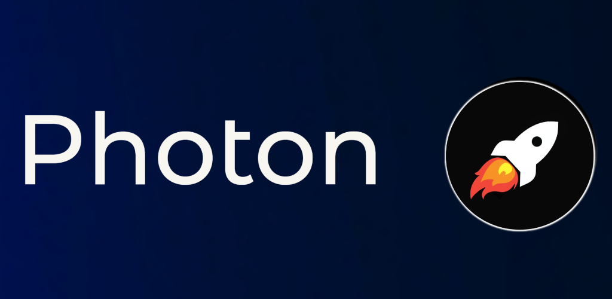

## Photon 

<h1 >Welcome to Photon👋</h1><br>
<p align="center"> </p>
<p>
  
  <a href="https://twitter.com/AbhilashHegde9" target="_blank">
    
  </a>
  
  []()
  []()
  []()
  [](https://www.codefactor.io/repository/github/abhi16180/photon)
</p>

> Photon is a cross-platform file-transfer application built using flutter. It uses http to transfer files between devices.You can transfer files between devices that run Photon.(*No wifi router is required ,you can use  hotspot*)


## Snapshots


## Current features
- **True  folder sharing**<br>
  Unlike other apps, photon preserves entire folder structure including sub-drectories on receivers' end.
- **Cross-platform support**<br>
  For instance you can transfer files between Android and Windows
- **Transfer multiple files**<br>
  You can pick any number of files.
- **Share raw text**<br>
  You can share raw text between devices. Store raw text as txt file or copy to clipboard.
- **Smooth UI**<br>
  Material You design.
- **Works between the devices connected via mobile-hotspot / between the devices connected to same router (same local area network)**
- **HTTPS support with token based validation on v3.0.0 or above**
Photon supports HTTPS on v3.0.0 or above with token based validation with random url path for each session. Older versions only use cryptographically secure secret code generation for authentication (internally), as url path for security which is secure than having static url path for all sessions. Still it is vulnerable to bruteforce attack. Use HTTPS when possible and use photon within trusted networks. 
- **Supports high-speed data transfer** <br>
  Photon is capable of transferring files at a very high rate but it depends upon the wifi bandwidth.
(No internet connection required)
## Platforms
- Android
- Windows 
- Linux
- macOS   
- iOS     
  - *Coming soon*


## Downloads

- Android 
<br>
<a href='https://play.google.com/store/apps/details?id=dev.abhi.photon&pcampaignid=pcampaignidMKT-Other-global-all-co-prtnr-py-PartBadge-Mar2515-1' ></a>
<br>
<a href="https://apt.izzysoft.de/fdroid/index/apk/dev.abhi.photon"> </a>
<br>

- Windows
<br>
<a title="Microsoft Corporation, CC BY-SA 4.0 &lt;https://creativecommons.org/licenses/by-sa/4.0&gt;, via Wikimedia Commons" href="https://github.com/abhi16180/photon/releases/download/v3.0.0/photon-windows-release-v3.0.0.zip"></a>
<br>
<br>
- macOS
<br>
<a title="Apple Inc., Public domain, via Wikimedia Commons" href="https://github.com/abhi16180/photon/releases/download/v3.0.0/photon-macos-x86_64-release-v3.0.0.dmg"></a> 
<br>
<br>
- Linux (bundle)
<br>
<a title="https://github.com/icons8/flat-color-icons/graphs/contributors, MIT &lt;http://opensource.org/licenses/mit-license.php&gt;, via Wikimedia Commons" href="https://github.com/abhi16180/photon/releases/download/v3.0.0/photon-linux-release-v3.0.0.zip"></a>
<br>
<a href="https://github.com/abhi16180/photon/releases/">All releases</a><br>


## To build app
```sh
flutter pub get packages
flutter run
```

### FAQ / Notes: 
- The **LICENSE** has been updated to GPL3 from MIT 
- **File transfer location:** Now you can edit file saving location. By default files will be stored at internal_storage/Download/Photon directory.

- If you run the program with `flutter run` and **if you see a blank application window instead of the UI**, try running `flutter run --enable-software-rendering` instead. 

## Notice of Logo Update

The app's logo has been updated to a new design to ensure uniqueness and avoid potential overlaps with other designs. This change is to maintain the app's unique identity and to avoid any confusion.
Photon v3.0.0 will come with new logo.
## Author

👤 **Abhilash Hegde**

* Twitter: [@AbhilashHegde9](https://twitter.com/AbhilashHegde9)

## Show your support

Give a ⭐️ if this project helped you!
<br>
You can support me by,
<br>
<a href="https://www.buymeacoffee.com/abhi1.6180" target="_blank"></a>
<br>
### UPI payment 

### Icon credits 

<a href="https://creativecommons.org/licenses/by-sa/4.0">Windows icon - Microsoft Corporation, CC BY-SA 4.0, via Wikimedia Commons</a>
<br>
<a href="https://commons.wikimedia.org/wiki/File:Finder_Icon_macOS_Big_Sur.png">Apple Icon - Apple Inc., Public domain, via Wikimedia Commons</a>
<br>
<a href="http://opensource.org/licenses/mit-license.php">Linux Icon - https://github.com/icons8/flat-color-icons/graphs/contributors, MIT , via Wikimedia Commons</a>


### Asset credits

- App Icon
  App icon is created using <a href="https://www.canva.com/">Canva</a>

- Avatars
  <a href="https://multiavatar.com/" target="_blank">Multiavatar</a>

- Icons
  <a href="https://www.svgrepo.com" target="_blank">SVG Repo</a>

- Font
  https://github.com/googlefonts/questrial

- Animations
  - <a href="https://lottiefiles.com/">Lottie animations</a>
    - fire
      - <a href="https://lottiefiles.com/t3yzvz06rzxlcv6c">Creator</a>
      - <a href="https://lottiefiles.com/free-animation/fire-animation-ejgvnKSGk7">Link to animation</a>

    - setting-up
      - <a href="https://lottiefiles.com/r2ykglps6p">Creator</a>
      - <a href="https://lottiefiles.com/free-animation/rocket-share-kQtY3BH2g7">Link to animation</a>

    - rocket-send
      - <a href="https://lottiefiles.com/0nxzu9heyo">Creator</a>
      - <a href="https://lottiefiles.com/free-animation/rocketman-XDUlDEjKIG">Link to animation</a>

    - receive-file
      - <a href="https://lottiefiles.com/mahendra">Creator</a>
      - <a href="https://lottiefiles.com/free-animation/download-Ch0PxCW02O">Link to animation</a>

    - searching
      - <a href="https://lottiefiles.com/954yw8ena9qkjead">Creator</a>
      - <a href="https://lottiefiles.com/free-animation/searching-mY2Hkc4Ol7">Link to animation</a>

    - wifi
      - <a href="https://lottiefiles.com/andrea">Creator</a>
      - <a href="https://lottiefiles.com/free-animation/wifi-blue-animation-MYEsONJAo7">Link to animation</a>

    - sender-not-found
      - <a href="https://lottiefiles.com/tf8qjm109o5bpuf5">Creator</a>
      - <a href="https://lottiefiles.com/free-animation/error-404-4Hedwc1tjf">Link to animation</a>

    - share
      - <a href="https://lottiefiles.com/karungany">Creator</a>
      - <a href="https://lottiefiles.com/free-animation/space-rocket-35kzN0j8QV">Link to animation</a>

### Licenses for Assets
This project includes third-party assets, such as animations, icons, and other media. The licenses for these assets are as follows:

- Lottie Animations:
Licensed under the terms specified by the creators on LottieFiles.

- SVG Icons from SVGRepo:
Licensed under [creative commons]

- Design:
As mentioned in credits, app logo is designed using Canva.
