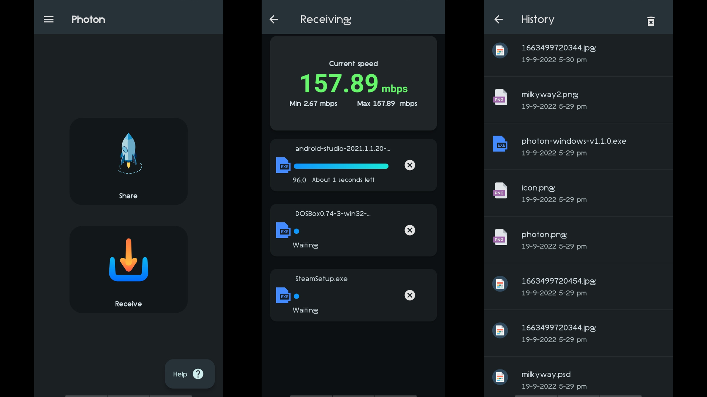

<h1 >Welcome to Photon👋</h1><br>
<p align="center"> </p>
<p>
  
  <a href="https://twitter.com/AbhilashHegde9" target="_blank">
    
  </a>
  
  []()
  []()
  []()
  [](https://www.codefactor.io/repository/github/abhi16180/photon)
</p>

> Photon is a cross-platform file-transfer application built using flutter. It uses http to transfer files between devices.You can transfer files between devices that run Photon.(*No wifi router is required ,you can use  hotspot*)


## Snapshots





## Current features

- **Cross-platform support**<br>
  For instance you can transfer files between Android and Windows
- **Transfer multiple files**<br>
  You can pick any number of files.
- **Pick files faster**<br>
  Most of the apps use <a href='https://github.com/miguelpruivo/flutter_file_picker'>file_picker</a> for picking the files. But for android it caches files before retrieving the paths. If the file size is large it will result in considerable amount of delay. So I have tweaked <a href='https://github.com/abhi16180/flutter_file_picker'>file_picker</a> to avoid caching(android) *unless it is required (some files need to be cached)*. No matter how many files are selected ,paths will be retrieved within no time.
  (Note:Caching issue is android specific)
- **Smooth UI**<br>
  Material You design.
- **Works between the devices connected via mobile-hotspot / between the devices connected to same router (same local area network)**

- **Uses cryptographically secure secret code generation for authentication (internally).**<br>
 Even though the files are streamed at local area network,files cannot be downloaded/received without using Photon. No external client like browser can get the files using url,as secret code is associated with url. It will be regenerated for every session.
- **Supports high-speed data transfer** <br>
  Photon is capable of transferring files at a very high rate but it depends upon the wifi bandwidth.
(No internet connection required)
## Platforms
- Android
- Windows 
- Linux
- macOS   
- iOS     
  - *Coming soon*


## Downloads

- Android 
<br>
<a href='https://play.google.com/store/apps/details?id=dev.abhi.photon&pcampaignid=pcampaignidMKT-Other-global-all-co-prtnr-py-PartBadge-Mar2515-1' ></a>
<br>
<a href="https://apt.izzysoft.de/fdroid/index/apk/com.example.photon"> </a>
<br>

- Windows
<br>
<a title="Microsoft Corporation, CC BY-SA 4.0 &lt;https://creativecommons.org/licenses/by-sa/4.0&gt;, via Wikimedia Commons" href="https://github.com/abhi16180/photon/releases/download/v1.1.0/photon-windows-signed-v1.1.0.msix"></a>
<br>
<br>
- macOS
<br>
<a title="Apple Inc., Public domain, via Wikimedia Commons" href="https://github.com/abhi16180/photon/releases/download/v1.1.0/photon-macos-x86_64-v1.1.0.dmg"></a> 
<br>
<br>
- Linux (appImage)
<br>
<a title="https://github.com/icons8/flat-color-icons/graphs/contributors, MIT &lt;http://opensource.org/licenses/mit-license.php&gt;, via Wikimedia Commons" href="https://github.com/abhi16180/photon/releases/download/v1.1.0/Photon-Linux-Bundle-v1.1.0.zip"></a>
<br>
<a href="https://github.com/abhi16180/photon/releases/">All releases</a><br>


## To build app
```sh
flutter pub get packages
flutter run
```

### Notes: 
- The LICENSE has been updated to GPL3 from MIT 
- File transfer location: Currently the app doesn't allow users to set a file-location. But before the sharing process starts, it will show the file-storing location (see image below). I have set downloads folder as file-storing location.


## Author

👤 **Abhilash Hegde**

* Twitter: [@AbhilashHegde9](https://twitter.com/AbhilashHegde9)

## Show your support

Give a ⭐️ if this project helped you!
<br>
You can support me by,
<br>
<a href="https://www.buymeacoffee.com/abhi1.6180" target="_blank"></a>


### Icon credits 

<a href="https://creativecommons.org/licenses/by-sa/4.0">Windows icon - Microsoft Corporation, CC BY-SA 4.0, via Wikimedia Commons</a>
<br>
<a href="https://commons.wikimedia.org/wiki/File:Finder_Icon_macOS_Big_Sur.png">Apple Icon - Apple Inc., Public domain, via Wikimedia Commons</a>
<br>
<a href="http://opensource.org/licenses/mit-license.php">Linux Icon - https://github.com/icons8/flat-color-icons/graphs/contributors, MIT , via Wikimedia Commons</a>

